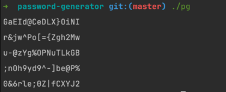

# password-generator
### full usage:
    ```
    pg -l -n -o -t -s -u 
    
    -l: the length of password        default: 16
    -n: the count of number in password         default: no limit 
    -o: the count of lowercase in password      default: random
    -u: the count of uppercase in password      default: random
    -s: the count of special character in password      default: random
    -t: how manay passwords to generate     default: 5
    
### example:
     
